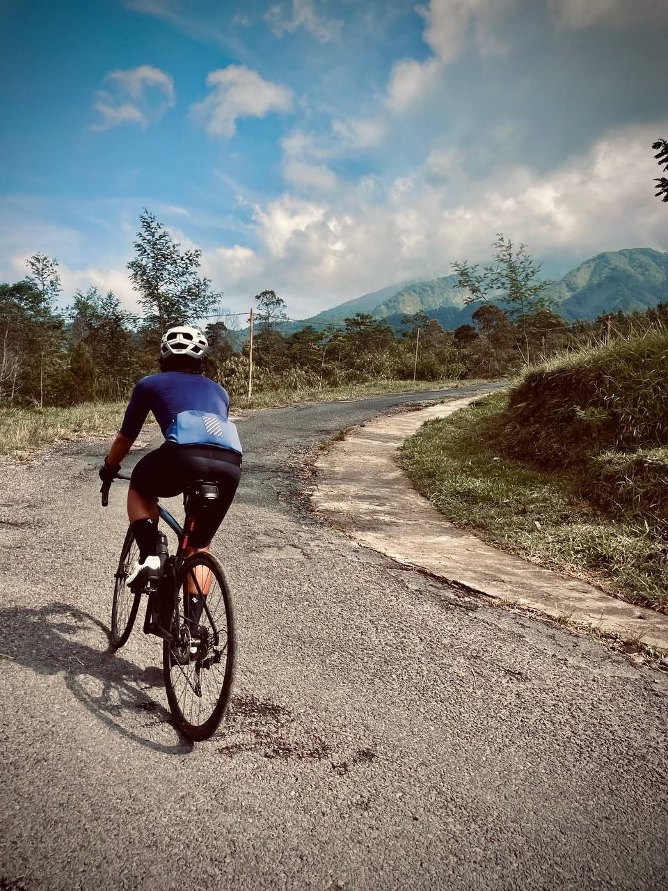

Beberapa waktu lalu aku ke Klangon dari Prambanan secara non-stop.

Pastinya bukan sesuatu yang impresif buat yang ada di sini. Mungkin udah pada sering, mungkin ada yang bisa melakukannya dengan satu tangan, dsb.

Tapi yang buatku, yang kulakukan kemaren itu nggak gampang, buatku ya, dan butuh beberapa faktor penting untuk ku bisa menyelesaikannya.

---

## Background

Sebelumnya, ini beberapa hal tentang aku:

- Aku mulai gowes lagi November 2020. Sebelumnya udah pernah rutin sepedaan di tahun 2011--2012 (ingat Endomondo?) tapi terus terlupakan.
- Usiaku hampir dan udah 40. Sedikit udah lewat masa pertumbuhan. Improveku lebih lambat dari mereka yang masih ~~bocah~~ muda.
- Aku seorang karyawan yang, walaupun waktu cukup fleksibel, tetap terbatas. Ditambah kewajiban sebagai kepala rumah tangga yang karena situasi dan kondisi, nggak bisa semaunya minggat.
- Tujuan gowes buatku adalah sebagai sarana eksplorasi, refreshing, dan ningkatin baseline fitness. Tapi ternyata dapat benefit lain setelah banyak gowes: banyak ketemu teman baru.

Sejak mulai sepedaan lagi, aku bikin list yang berisi spot-spot yang pengen aku samperin pake sepeda, yang aku kompilasi dari hasil kepo di Strava dan Instagram. Dan juga ada hal-hal lain yang pengen aku lakuin dengan sepeda terutama long ride antar kota (ultra!).

### The need for power

Satu hal yang aku sadari setelah mulai menjalani sepedaan lagi adalah, bahwa aku butuh kuat di atas sepeda biar bisa eksplorasi. Aku butuh kuat karena banyak medan yang menantang. Aku butuh kuat supaya siap menghadapi berbagai medan di rute yang dilalui. Sukur-sukur bisa nggak full effort ketika ngelakuin eksplorasi --- biar bisa menikmati eksplorasinya pastinya.

Aku menyadari bahwa latian sepeda biar kuat itu butuh volume dan frekuensi yang tidak kecil. Kilometer yang banyak, EG yang banyak, dan rutin dan konsisten. Tapi karena keterbatasan waktu, aku butuh latian yang efektif. Aku nggak pengen buang-buang waktu dan capek kalo latian tersebut nggak bikin aku tambah “strong” (i.e., junk miles).

Aku perlu “program” latian yang efektif. “Program” latian yg efektif adalah latian-latian yang berkualitas. Untuk melihat sesuatu itu berkualitas apa enggak, perlu ada ukurannya.

### The metrics

Kalo kita buka Strava, masing-masing kita ada PR untuk berbagai segments yang pernah kita lalui. Tapi PR segments itu bukan ukuran. PR dan avg speed adalah buah hasil latian, bukan ukuran latiannya.

Jadi apa yang diukur?

Ada beberapa cara untuk melihat progress latian. Kebetulan yang jadi acuanku adalah power dibandingkan dengan HR. Contohnya begini. Misal hari ini, disebuah segment, power 200W, HR 170bpm. Sebulan kemudian, kalau latihannya berprogress, di segment yang sama dengan kondisi yang mirip, dengan power 200W, HR mungkin udah turun jadi 165bpm. Artinya kita menghasilkan power yang sama dengan "effort" yang kita rasakan lebih rendah.

### The upgrades

Dan dari situlah aku bisa meyakinkan diri buat “upgrade” bukan ke sepeda, tapi fokus untuk “upgrade” ke mesinnya dengan jalan mengalihkan budget ke alat-alat yang bisa mengukur latian-latianku secara efektif. Ada beberapa tool “upgrade” yang mendukung latian.

- HRM — ini udah sangat umum. Buat monitor HR saat kita ride.
- Smartwatch — buat ngukur resting HR. Karena resting HR itu adalah salah satu indikator utama level fitness seseorang.
- Smart trainer — biar latihan lebih fleksibel terhadap cuaca dan jadwal, dan buat ngelakuin beberapa latian yang susah dilakukan di outdoor terutama latian seperti intervals, cadence, dan sustained tempo.
- Power meter — terutama buat di outdoor. Untuk mengukur secara objective apakah latian udah membuahkan hasil.

Nah dari situ tinggal rutin beberapa kali seminggu dan antara 30 menit sampai 2 jam atau lebih (isi dari programnya itu sendiri ada ceritanya tersendiri) sambil direview metrik-metriknya untuk melihat perkembangan.

---

## First ride to Klangon: pacing by power

Balik ke topik utama kita.

Di sini aku akan lebih ke bercerita tentang bagaimana aku planning pacing-ku untuk bisa ride non-stop Prambanan -- Klangon. 

### Facts

- Aku belum pernah gowes ke Klangon sama sekali. Udah pernah ke Klangon pake mobil jadi udah punya gambaran kaya gimana beratnya kalo pake sepeda.
- Dari 4 summits lereng selatan Merapi, belum ada satu pun yang aku pernah gowes non-stop. Terakhir ke Goa Jepang beberapa bulan lalu dan itu belum non-stop.
- FTP ku cuma 170an Watt dengan berat badan 69--70 kg ⇒ 2,4 W/kg (terakhir test awal Juni)

### Gathering data and analyzing them

- Berawal bingung di Jum’at siang, Sabtu mau ke mana → Eenk suggest ke Klangon
- Aku minta Eenk nunjukin link Strava ke ride-ride dia ke Klangon karena dia pake power meter dan berat badan kita mirip-mirip — overall mungkin beda 2--4 kg.
- Yang pertama aku analisa adalah apakah memungkinkan apa enggak secara umum. Berapa avg power dan durasinya. Eenk, untuk segment Prambanan -- Klangon butuh avg power 176w dengan durasi 1,5 jam.
- Yang selanjutnya aku analisa adalah apakah wkg-ku cukup untuk climb-climb gradient tinggi yang ada di rute.

### Analysis results

- Berdasar analisa ride Eenk, semua masih achievable buatku buat non-stop dari Prambanan ke Klangon. Tapi aku kudu cari pace yang tepat buatku.
- Dengan FTP ku yang 170an Watt, it’s impossible kalo aku target 1,5 jam dengan avg power 176W kaya Eenk, karena itu over FTP ku dan dengan durasi lebih dari satu jam. Sementara kita tau bahwa nahan power di FTP itu kira-kira cuma cukup untuk satu jam. Aku kudu turunin target avg power (pace).
- Dengan sedikit ngawang, aku kira-kira bahwa aku bisa main di power 140--150W dengan reserve power untuk akhir-akhir yang ada gradient berat yang kira-kira butuh 170--200W hanya untuk bisa gerak.

### Ride result

- Finish full non-stop dari ring-road Maguwo sampe ke Klangon --- dengan sedikit distraksi ketemu ~~Bogi di antara~~ peserta KAI100
- Kaki udah menjerit-jerit di portal Klangon tapi masih bisa dipaksa buat sampe tulisan besar "KLANGON"

### Some stats

- Segment New Road - Butuh Market: avg 155W 36:04
- Segment Butuh Market to Klangon: avg 135W 1:13:51
- Segment RR Maguwo - Klangon: avg 140W 2:21:55
- Segment Prambanan - Klangon: avg **141W** 1:57:43. **Tepat sesuai estimasi (!!!)**

---

## Closing

Apakah bisa aku melakukannya tanpa power meter?

Mungkin bisa. Tapi, power meter ini terbukti sangat membantu untuk tau kapan menahan dan kapan untuk nge-push karena, dari kenyataannya di lapangan, terjadi beberapa kali ~~hampir~~ kecolongan salah power.

---

_Terima kasih buat [eenk](https://x.com/hendriansah) yang udah bantu provide data-datanya dan, tentu saja, menemani dan menyemangati selama ride (ya... beberapa kali aku ditinggal ke depan buat ngudud)._

_Terima kasih buat [Amar Muammar](https://www.strava.com/athletes/41964148) dan [Bogipower](https://www.strava.com/athletes/23853365) yang sudah memberi masukan terhadap tulisan ini._

_Update 8 Juli 2024: pengen hitungan yang "pro"? Bisa coba pake [ini](https://wwww.bestbikessplit.com/) (bukan endorse). Shout out to [Hendy Saputra](https://www.strava.com/athletes/27389527) yang udah nunjukin._ 
